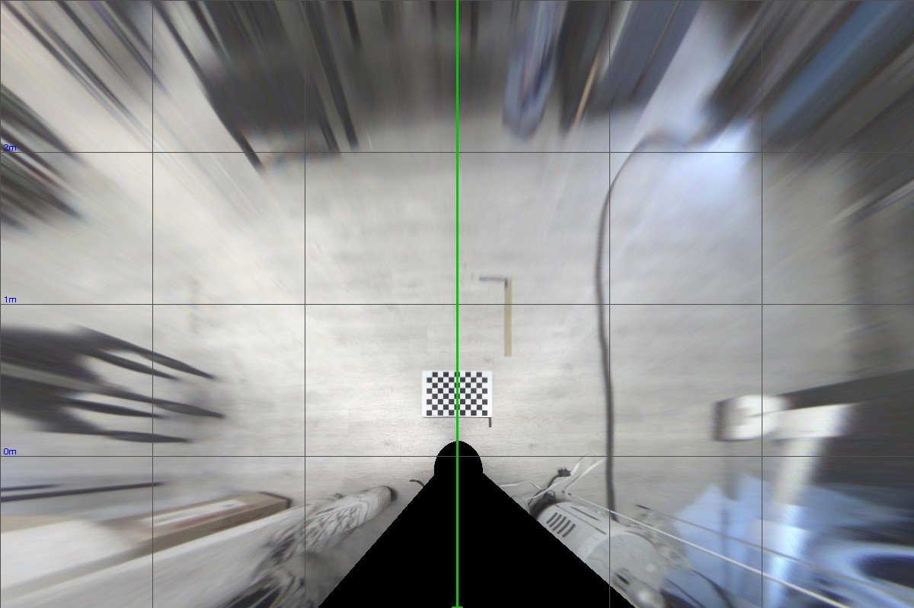
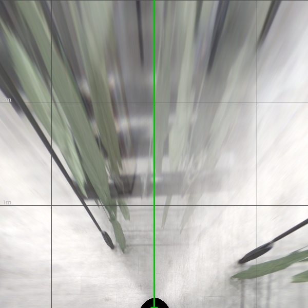
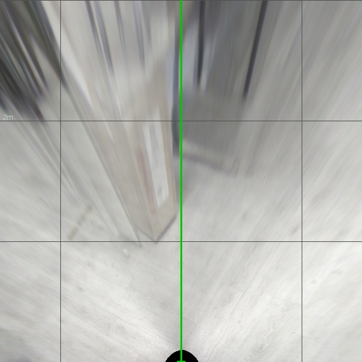

# BEV POC — IPM 기반 Bird's Eye View 변환

어안 듀얼 카메라(AR0234)로 촬영한 영상을 IPM(Inverse Perspective Mapping) 기반으로
Bird's Eye View(평면 시점)로 변환하는 PoC.

- **하드웨어**: NVIDIA Jetson AGX Orin / ArduCam AR0234 듀얼 / 1.56 mm 어안 렌즈
- **파이프라인**: Intrinsic 캘리브레이션 → Extrinsic 캘리브레이션 → LUT 기반 BEV 변환

자세한 배경·이론·결과 해석은 [docs/PROJECT_SUMMARY.md](docs/PROJECT_SUMMARY.md) 참고.

---

## 결과 미리보기

좌·우 카메라 영상을 지면 평면(z=0)으로 역투영하고, 두 결과를 합쳐 합성 BEV 이미지를 생성한다.

| Test 시나리오 | Combined BEV |
| --- | --- |
| `best senarios` — Extrinsic을 계산할 때 사용한 이미지를 그대로 변환 |  |
| `bad senarios` — 모형 재배단 등 비평면 객체 테스트 |  |
| `plane-again` — 카메라 위치를 옮긴 후 재검증 |  |

위 이미지는 `bev_transform.py` 의 `combined_bev.jpg` 출력. 좌/우 단독 BEV(`left_bev.jpg`, `right_bev.jpg`)도 함께 저장된다.

---

## 폴더 구조

```text
bev_poc/
├── intrinsic_calibration.py     # 어안 모델 내부 파라미터 추정
├── extrinsic_calibration.py     # 지면 체커보드로 외부 파라미터 추정
├── bev_transform.py             # 캘리브레이션 결과로 BEV 이미지 생성
├── export_cal_data.py           # .npz → .yaml 변환 (사람이 읽기 위한 용도)
├── requirements.txt
│
├── docs/
│   ├── PROJECT_SUMMARY.md       # 시스템 구성, 이론, 좌표계, 실행 절차 정리
│   ├── sample_logs/             # 캘리브레이션 결과 콘솔 출력 예시
│   └── sample_results/          # README에 임베드된 BEV 미리보기
│
├── calib_params/                # 캘리브레이션 파라미터 (코드 입력으로 사용)
│   ├── {left,right}_intrinsic_result.{npz,yaml}
│   ├── {left,right}_extrinsic_result.{npz,yaml}
│   └── {left,right}_bev_lut.{npz,yaml}
│
├── calib_imgs/                  # 캘리브레이션 입력 이미지 (.gitignore)
│   ├── intrinsic/{left,right}/
│   └── extrinsic/
│
└── examples/                    # BEV 변환 데모 (.gitignore)
    ├── inputs/                  # 테스트 시나리오별 좌/우 원본
    └── outputs/                 # 좌 BEV / 우 BEV / 합성 BEV
```

---

## Setup

```bash
pip install -r requirements.txt
```

(`opencv-python`, `numpy`)

---

## 사용 절차

### 1) 좌·우 카메라 Intrinsic 캘리브레이션

체커보드 이미지를 `calib_imgs/intrinsic/{left,right}/` 에 모은 뒤:

```bash
python intrinsic_calibration.py \
    --img_dir calib_imgs/intrinsic/left \
    --output  calib_params/left_intrinsic_result.npz \
    --board_w 10 --board_h 7 --square_size 0.036 \
    --model fisheye

python intrinsic_calibration.py \
    --img_dir calib_imgs/intrinsic/right \
    --output  calib_params/right_intrinsic_result.npz \
    --board_w 10 --board_h 7 --square_size 0.036 \
    --model fisheye
```

### 2) Extrinsic 캘리브레이션 (지면 좌표계 정렬)

월드 원점은 카메라 리그 바로 아래 지면(체커보드 가장 가까운 코너 기준):

```bash
python extrinsic_calibration.py \
    --left_img  calib_imgs/extrinsic/ar0234_left_cam.jpg \
    --right_img calib_imgs/extrinsic/ar0234_right_cam.jpg \
    --left_npz  calib_params/left_intrinsic_result.npz \
    --right_npz calib_params/right_intrinsic_result.npz \
    --board_w 10 --board_h 7 --square_size 0.036 \
    --output_dir calib_params
```

### 3) BEV 변환

```bash
python bev_transform.py \
    --left_img  examples/inputs/test2_leaf-hanger/ar0234_left_cam.jpg \
    --right_img examples/inputs/test2_leaf-hanger/ar0234_right_cam.jpg \
    --cal_dir   calib_params \
    --output_dir examples/outputs/test2 \
    --save_lut
```

`--save_lut` 으로 한 번 LUT 를 저장해 두면, 이후 같은 시점에서는 `--load_lut` 으로 즉시 재사용.

### 4) (Option) 파라미터 가독성 변환

```bash
python export_cal_data.py --cal_dir calib_params
```

`calib_params/` 의 모든 `.npz` 옆에 `.yaml` 을 생성한다.

---

## 캘리브레이션 자산 (Git 미포함)

용량 문제로 `calib_imgs/` 와 `examples/inputs|outputs/` 는 `.gitignore` 처리되어 있다.
재현하려면 위 폴더 구조 그대로 로컬에 채워 사용. `calib_params/` 에는 이미 추정된 파라미터가
포함되어 있어 새 입력 이미지만 있으면 step 3 부터 바로 실행 가능.
